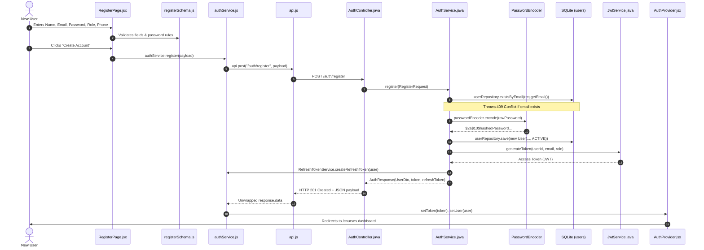
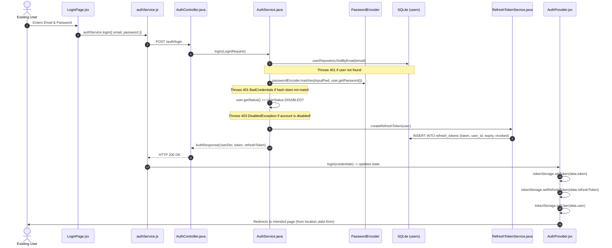
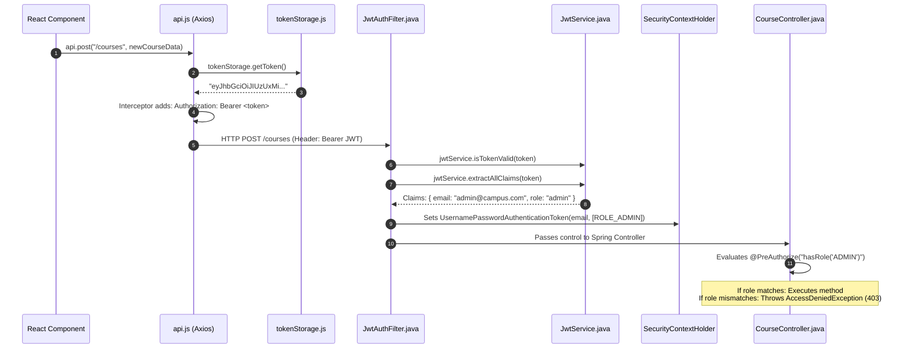
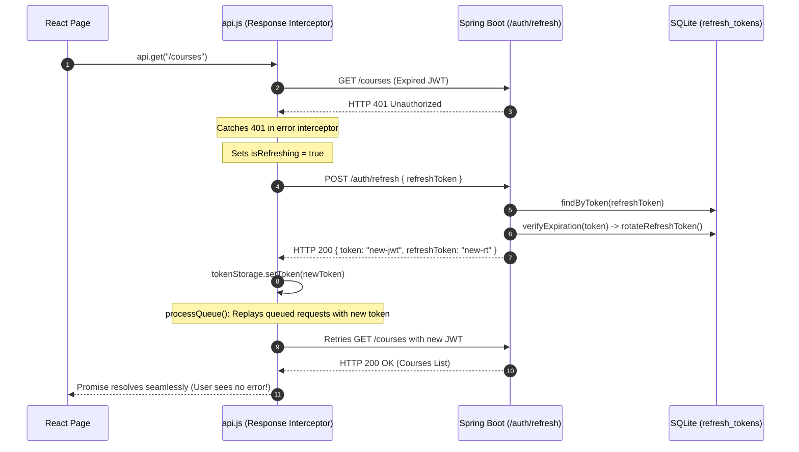

# 🔐 Authentication & Role-Based Access Control (RBAC) Architecture

> **Purpose of this guide:** Complete, file-by-file walkthrough of the authentication and authorization subsystem. It traces exactly how data and control move from user input on the frontend to database persistence on the backend and back, with complete code references.

---

## 📑 Table of Contents

1. [High-Level Architecture & Principles](#1-high-level-architecture--principles)
2. [Authentication File Map & Responsibilities](#2-authentication-file-map--responsibilities)
3. [Journey 1: User Registration Flow](#3-journey-1-user-registration-flow)
4. [Journey 2: User Login Flow](#4-journey-2-user-login-flow)
5. [Journey 3: Authenticated Request & RBAC Enforcement](#5-journey-3-authenticated-request--rbac-enforcement)
6. [Journey 4: Silent Token Refresh (The 401 Interceptor)](#6-journey-4-silent-token-refresh-the-401-interceptor)
7. [Journey 5: Profile Password Change & Logout](#7-journey-5-profile-password-change--logout)
8. [Top 10 Viva & Interview Questions on Authentication](#8-top-10-viva--interview-questions-on-authentication)

---

## 1. High-Level Architecture & Principles

The system implements a **Dual-Token, Stateless Authentication Model** with method-level **Role-Based Access Control (RBAC)** across three personas: `ADMIN`, `INSTRUCTOR`, and `STUDENT`.

```
               ┌────────────────────────────────────────────────────────┐
               │                   Client (React 19)                    │
               │  • Zod Validation   • AuthProvider   • Axios Client     │
               └──────────────┬─────────────────────────▲───────────────┘
                              │                         │
            1. POST /auth/login (email/pwd)             │ 3. Returns:
                              │                         │    • Access Token (JWT, 15m)
                              ▼                         │    • Refresh Token (UUID, 7d)
               ┌────────────────────────────────────────┴───────────────┐
               │               Backend (Spring Boot 3.3.4)              │
               │  • BCrypt Hash Check   • UserStatus Guard              │
               │  • JwtService          • RefreshTokenService           │
               └──────────────┬─────────────────────────────────────────┘
                              │
                              ▼
               ┌────────────────────────────────────────────────────────┐
               │                   SQLite Database                      │
               │  • users (password hashes, roles, status)              │
               │  • refresh_tokens (token UUID, user_id, expiry, revoke)│
               └────────────────────────────────────────────────────────┘
```

### Core Security Invariants

1. **Stateless API**: No server HTTP sessions (`SessionCreationPolicy.STATELESS`). The server does not store session cookies; every request is authenticated via the HTTP `Authorization: Bearer <token>` header.
2. **Dual-Token Architecture**:
    - **Access Token (JWT)**: Short-lived (15 minutes). Self-contained, signed with HMAC-SHA512. Contains user ID, email, and role.
    - **Refresh Token (Opaque UUID)**: Long-lived (7 days). Stored in the `refresh_tokens` database table. Can be revoked immediately.
3. **Defense-in-Depth Validation**:
    - Client-side: Real-time feedback with Zod schemas and live password checklist.
    - Server-side: Jakarta Bean Validation (`@Valid`, `@NotBlank`, `@Pattern`, `@Size`) before any service logic executes.
4. **Account State Guardrails**:
    - Users with status `DISABLED` cannot log in (`DisabledException`).
    - Admins cannot disable their own accounts.
    - Passwords are encrypted with BCrypt (salted, cost factor 10).

---

## 2. Authentication File Map & Responsibilities

### 🎨 Frontend Layer (`src/`)

| File                                                                                                                                   | Exact Responsibility                                                                                                                                      |
| -------------------------------------------------------------------------------------------------------------------------------------- | --------------------------------------------------------------------------------------------------------------------------------------------------------- |
| [`src/features/auth/loginSchema.js`](file:///Users/manjesh/Desktop/Course/course/src/features/auth/loginSchema.js)                     | Zod validation schema for login (email format and required password).                                                                                     |
| [`src/features/auth/registerSchema.js`](file:///Users/manjesh/Desktop/Course/course/src/features/auth/registerSchema.js)               | Zod validation for registration (name, email, role, phone, NIST-compliant password rules).                                                                |
| [`src/features/auth/PasswordRequirements.jsx`](file:///Users/manjesh/Desktop/Course/course/src/features/auth/PasswordRequirements.jsx) | Live UI checklist displaying 5 password strength rules as the user types.                                                                                 |
| [`src/services/tokenStorage.js`](file:///Users/manjesh/Desktop/Course/course/src/services/tokenStorage.js)                             | Storage abstraction handling `sessionStorage` (access token, refresh token, user object).                                                                 |
| [`src/services/api.js`](file:///Users/manjesh/Desktop/Course/course/src/services/api.js)                                               | Configured Axios client with: <br>1. Request interceptor injecting `Bearer <token>`<br>2. Response interceptor executing **silent token refresh** on 401. |
| [`src/services/authService.js`](file:///Users/manjesh/Desktop/Course/course/src/services/authService.js)                               | Client API calls (`login`, `register`, `refreshToken`, `logout`, `changePassword`).                                                                       |
| [`src/context/AuthProvider.jsx`](file:///Users/manjesh/Desktop/Course/course/src/context/AuthProvider.jsx)                             | Global React context provider storing active user, token, and permission checker callbacks.                                                               |
| [`src/hooks/useAuth.js`](file:///Users/manjesh/Desktop/Course/course/src/hooks/useAuth.js)                                             | Custom hook exposing `user`, `role`, `isAdmin`, `isInstructor`, `isStudent`, `login()`, `logout()`.                                                       |
| [`src/components/layout/ProtectedRoute.jsx`](file:///Users/manjesh/Desktop/Course/course/src/components/layout/ProtectedRoute.jsx)     | Route guard verifying authentication and role authorization before rendering protected pages.                                                             |
| [`src/App.jsx`](file:///Users/manjesh/Desktop/Course/course/src/App.jsx)                                                               | Central route tree organizing public auth routes (`/login`, `/register`) and protected dashboard routes.                                                  |

---

### ⚙️ Backend Layer (`backend/src/main/java/com/courseenrollment/`)

| File                                                                                                                                                                                | Exact Responsibility                                                                                                             |
| ----------------------------------------------------------------------------------------------------------------------------------------------------------------------------------- | -------------------------------------------------------------------------------------------------------------------------------- |
| [`config/SecurityConfig.java`](file:///Users/manjesh/Desktop/Course/course/backend/src/main/java/com/courseenrollment/config/SecurityConfig.java)                                   | Configures Spring Security: filter chain, stateless session, public vs authenticated paths, CORS, BCrypt bean.                   |
| [`config/JwtService.java`](file:///Users/manjesh/Desktop/Course/course/backend/src/main/java/com/courseenrollment/config/JwtService.java)                                           | Generates, parses, and validates HMAC-SHA512 signed JWT access tokens.                                                           |
| [`config/JwtAuthFilter.java`](file:///Users/manjesh/Desktop/Course/course/backend/src/main/java/com/courseenrollment/config/JwtAuthFilter.java)                                     | `OncePerRequestFilter` that inspects `Authorization: Bearer <token>`, verifies signature, and populates `SecurityContextHolder`. |
| [`auth/entity/User.java`](file:///Users/manjesh/Desktop/Course/course/backend/src/main/java/com/courseenrollment/auth/entity/User.java)                                             | JPA entity for `users` table (`email`, `name`, `password`, `role`, `status`, `phone`).                                           |
| [`auth/entity/RefreshToken.java`](file:///Users/manjesh/Desktop/Course/course/backend/src/main/java/com/courseenrollment/auth/entity/RefreshToken.java)                             | JPA entity for `refresh_tokens` table (`token`, `user_id`, `expiryDate`, `revoked`).                                             |
| [`auth/repository/UserRepository.java`](file:///Users/manjesh/Desktop/Course/course/backend/src/main/java/com/courseenrollment/auth/repository/UserRepository.java)                 | Database queries for user lookup by email, role, and status.                                                                     |
| [`auth/repository/RefreshTokenRepository.java`](file:///Users/manjesh/Desktop/Course/course/backend/src/main/java/com/courseenrollment/auth/repository/RefreshTokenRepository.java) | Database queries for refresh token lookup and user session revocation.                                                           |
| [`auth/service/RefreshTokenService.java`](file:///Users/manjesh/Desktop/Course/course/backend/src/main/java/com/courseenrollment/auth/service/RefreshTokenService.java)             | Handles refresh token creation, expiration check, rotation, and revocation.                                                      |
| [`auth/service/AuthService.java`](file:///Users/manjesh/Desktop/Course/course/backend/src/main/java/com/courseenrollment/auth/service/AuthService.java)                             | Core business logic for registration, credential verification, disabled checks, and token issuance.                              |
| [`auth/controller/AuthController.java`](file:///Users/manjesh/Desktop/Course/course/backend/src/main/java/com/courseenrollment/auth/controller/AuthController.java)                 | REST endpoints for `/auth/login`, `/auth/register`, `/auth/refresh`, `/auth/change-password`.                                    |

---

## 3. Journey 1: User Registration Flow



### Important Code: Registration

#### 1. Frontend Zod Validation ([`src/features/auth/registerSchema.js`](file:///Users/manjesh/Desktop/Course/course/src/features/auth/registerSchema.js#L26-L55))

```javascript
export const registerSchema = z.object({
    name: z.string().trim().min(2, "Name must be at least 2 characters"),
    email: z.string().trim().email("Please enter a valid email address"),
    password: z
        .string()
        .min(8, "Password must be at least 8 characters")
        .regex(/[A-Z]/, "Password must contain at least one uppercase letter")
        .regex(/[a-z]/, "Password must contain at least one lowercase letter")
        .regex(/[0-9]/, "Password must contain at least one digit")
        .regex(
            /[@$!%*?&#]/,
            "Password must contain at least one special character"
        ),
    role: z.enum([ROLES.STUDENT, ROLES.INSTRUCTOR]),
    phone: z
        .string()
        .regex(
            /^[0-9]{10,15}$/,
            "Phone number must be between 10 and 15 digits"
        ),
});
```

#### 2. Backend Registration Logic ([`backend/.../AuthService.java`](file:///Users/manjesh/Desktop/Course/course/backend/src/main/java/com/courseenrollment/auth/service/AuthService.java#L45-L75))

```java
@Transactional
public AuthResponse register(RegisterRequest req) {
    if (userRepository.existsByEmail(req.getEmail())) {
        throw new ConflictException("Email already registered");
    }

    UserRole role = UserRole.STUDENT;
    if (req.getRole() != null && !req.getRole().trim().isEmpty()) {
        UserRole requestedRole = UserRole.fromValue(req.getRole().trim());
        // Prevent privilege escalation: public registration cannot register as ADMIN
        if (requestedRole != UserRole.ADMIN) {
            role = requestedRole;
        }
    }

    String hashedPassword = passwordEncoder.encode(req.getPassword());
    User user = new User(req.getEmail().trim(), req.getName().trim(), hashedPassword, role, UserStatus.ACTIVE, req.getPhone());
    User savedUser = userRepository.save(user);

    String token = jwtService.generateToken(savedUser.getId(), savedUser.getEmail(), savedUser.getRole().getValue());
    RefreshToken refreshToken = refreshTokenService.createRefreshToken(savedUser);

    return new AuthResponse(UserDto.fromEntity(savedUser), token, refreshToken.getToken());
}
```

---

## 4. Journey 2: User Login Flow



### Important Code: Login Logic ([`backend/.../AuthService.java`](file:///Users/manjesh/Desktop/Course/course/backend/src/main/java/com/courseenrollment/auth/service/AuthService.java#L95-L125))

```java
@Transactional
public AuthResponse login(LoginRequest req) {
    User user = userRepository.findByEmail(req.getEmail().trim())
            .orElseThrow(() -> new BadCredentialsException("Invalid username or password"));

    // 1. Verify BCrypt password hash
    if (!passwordEncoder.matches(req.getPassword(), user.getPassword())) {
        throw new BadCredentialsException("Invalid username or password");
    }

    // 2. Account Status Check (Disabled Account Guard)
    if (user.getStatus() == UserStatus.DISABLED) {
        throw new DisabledException("Account is disabled. Please contact the administrator.");
    }

    // 3. Issue Access Token (JWT)
    String token = jwtService.generateToken(
            user.getId(),
            user.getEmail(),
            user.getRole().getValue()
    );

    // 4. Issue and Persist Refresh Token in Database
    RefreshToken refreshToken = refreshTokenService.createRefreshToken(user);

    return new AuthResponse(UserDto.fromEntity(user), token, refreshToken.getToken());
}
```

---

## 5. Journey 3: Authenticated Request & RBAC Enforcement

Whenever an authenticated user performs an action (e.g. creating a course or viewing students):



### Important Code: Request Interceptor ([`src/services/api.js`](file:///Users/manjesh/Desktop/Course/course/src/services/api.js#L26-L35))

```javascript
// Automatically attaches Bearer token to all outgoing requests
api.interceptors.request.use((config) => {
    const token = tokenStorage.getToken();
    if (token) {
        config.headers.Authorization = `Bearer ${token}`;
    }
    return config;
});
```

### Important Code: Server Security Filter ([`backend/.../JwtAuthFilter.java`](file:///Users/manjesh/Desktop/Course/course/backend/src/main/java/com/courseenrollment/config/JwtAuthFilter.java#L35-L64))

```java
@Override
protected void doFilterInternal(HttpServletRequest request, HttpServletResponse response, FilterChain filterChain)
        throws ServletException, IOException {

    final String authHeader = request.getHeader("Authorization");
    if (authHeader == null || !authHeader.startsWith("Bearer ")) {
        filterChain.doFilter(request, response);
        return;
    }

    final String token = authHeader.substring(7);

    try {
        if (jwtService.isTokenValid(token)) {
            Claims claims = jwtService.extractAllClaims(token);
            String email = claims.get("email", String.class);
            String role = claims.get("role", String.class);

            if (email != null && SecurityContextHolder.getContext().getAuthentication() == null) {
                // Spring Security requires "ROLE_" prefix for hasRole() checks
                String authority = "ROLE_" + (role != null ? role.toUpperCase() : "STUDENT");
                List<SimpleGrantedAuthority> authorities = Collections.singletonList(
                        new SimpleGrantedAuthority(authority)
                );

                UsernamePasswordAuthenticationToken authToken =
                        new UsernamePasswordAuthenticationToken(email, null, authorities);
                authToken.setDetails(new WebAuthenticationDetailsSource().buildDetails(request));

                // Authenticate this request thread
                SecurityContextHolder.getContext().setAuthentication(authToken);
            }
        }
    } catch (Exception ignored) {
        // Token invalid/expired: request proceeds unauthenticated
    }

    filterChain.doFilter(request, response);
}
```

---

## 6. Journey 4: Silent Token Refresh (The 401 Interceptor)

### The Problem

Access tokens intentionally expire quickly (15 minutes). When an access token expires mid-session, making a normal API call will result in an HTTP `401 Unauthorized` response.

### The Solution: Silent Token Refresh

The Axios response interceptor in [`src/services/api.js`](file:///Users/manjesh/Desktop/Course/course/src/services/api.js) catches the `401`, holds any other incoming requests in a **concurrency queue**, requests a new JWT using the `refreshToken`, and re-executes the original request seamlessly.



### Important Code: The 401 Interceptor with Concurrency Queue ([`src/services/api.js`](file:///Users/manjesh/Desktop/Course/course/src/services/api.js#L54-L117))

```javascript
let isRefreshing = false;
let failedQueue = [];

const processQueue = (error, token = null) => {
    failedQueue.forEach((prom) => {
        if (error) prom.reject(error);
        else prom.resolve(token);
    });
    failedQueue = [];
};

api.interceptors.response.use(
    (response) => response.data,
    async (error) => {
        const originalRequest = error.config;
        const status = error.response?.status;

        const isAuthRoute =
            originalRequest?.url?.includes(API_ENDPOINTS.LOGIN) ||
            originalRequest?.url?.includes(API_ENDPOINTS.REGISTER) ||
            originalRequest?.url?.includes(API_ENDPOINTS.REFRESH);

        // Intercept 401 on non-auth routes
        if (status === 401 && !originalRequest?._retry && !isAuthRoute) {
            const refreshToken = tokenStorage.getRefreshToken();
            if (refreshToken) {
                // If a refresh is already in progress, enqueue this request
                if (isRefreshing) {
                    return new Promise((resolve, reject) => {
                        failedQueue.push({ resolve, reject });
                    })
                        .then((newToken) => {
                            originalRequest.headers.Authorization = `Bearer ${newToken}`;
                            return api(originalRequest);
                        })
                        .catch((err) => Promise.reject(err));
                }

                originalRequest._retry = true;
                isRefreshing = true;

                try {
                    // Request fresh access token using refresh token
                    const response = await axios.post(
                        `${API_CONFIG.BASE_URL}${API_ENDPOINTS.REFRESH}`,
                        { refreshToken },
                        { headers: { "Content-Type": "application/json" } }
                    );

                    const {
                        token,
                        refreshToken: newRefreshToken,
                        user,
                    } = response.data;
                    if (token) tokenStorage.setToken(token);
                    if (newRefreshToken)
                        tokenStorage.setRefreshToken(newRefreshToken);
                    if (user) tokenStorage.setUser(user);

                    // Replay all queued requests with the new token
                    processQueue(null, token);
                    originalRequest.headers.Authorization = `Bearer ${token}`;
                    return api(originalRequest);
                } catch (refreshErr) {
                    // Refresh token expired or revoked -> force logout
                    processQueue(refreshErr, null);
                    tokenStorage.clear();
                    if (typeof onAuthErrorCallback === "function") {
                        onAuthErrorCallback();
                    }
                    return Promise.reject(
                        new Error("Session expired. Please log in again.")
                    );
                } finally {
                    isRefreshing = false;
                }
            }
        }
        return Promise.reject(error);
    }
);
```

---

## 7. Journey 5: Profile Password Change & Logout

### 1. In-Profile Password Change

When a user updates their password on [`src/pages/ProfilePage.jsx`](file:///Users/manjesh/Desktop/Course/course/src/pages/ProfilePage.jsx):

1. **Frontend**: Prompts for `oldPassword`, `newPassword`, and `confirmPassword`.
2. **Backend**:
    - Compares `oldPassword` against stored BCrypt hash (`passwordEncoder.matches`).
    - Ensures `newPassword` meets NIST password complexity rules.
    - Saves new BCrypt hash.
    - **Revokes all existing refresh tokens** for this user (`refreshTokenService.revokeAllUserTokens(user)`), terminating all active sessions on other devices.
3. **Frontend**: Clears `tokenStorage`, invokes `logout()`, and redirects to `/login` with toast: _"Password changed successfully. Please sign in with your new password."_

### 2. Standard Logout

1. Frontend calls [`authService.logout()`](file:///Users/manjesh/Desktop/Course/course/src/services/authService.js):
    - Sends `POST /auth/logout` with the stored `refreshToken`.
    - Backend marks the refresh token record as `revoked = true`.
2. `tokenStorage.clear()` wipes `token`, `refreshToken`, and `user` from browser storage.
3. `AuthProvider` sets `user = null` and `token = null`.
4. React Router redirects user to `/login`.

---

## 8. Top 10 Viva & Interview Questions on Authentication

### Q1: Why use Dual Tokens (Access + Refresh) instead of one long-lived JWT?

> **Answer:** _"Because pure JWTs are stateless, they cannot be invalidated before they naturally expire unless you build an in-memory blocklist. A short-lived JWT (15 min) limits the blast radius if intercepted. The database-backed refresh token gives us the ability to instantly revoke a user's session upon logout, account deactivation, or password change."_

### Q2: Why is CSRF protection disabled in Spring Security (`csrf.disable()`)?

> **Answer:** _"CSRF attacks exploit the browser's automatic inclusion of session cookies on cross-origin requests. Since our application is stateless and sends the token via the `Authorization: Bearer` header (stored in `sessionStorage`), browsers do not attach it automatically across sites. Therefore, CSRF protection is unnecessary."_

### Q3: What prevents race conditions when 5 parallel API requests fail with 401 at the same time?

> **Answer:** _"In `src/services/api.js`, we use a boolean flag `isRefreshing` and a queue `failedQueue`. The first 401 triggers the refresh call. The remaining 4 requests are placed into `failedQueue`. Once the refresh finishes, `processQueue()` resolves all 4 waiting promises with the new token and re-executes them simultaneously."_

### Q4: How are passwords stored securely?

> **Answer:** _"Passwords are hashed with BCrypt using Spring Security's `BCryptPasswordEncoder` (work factor 10). BCrypt is an adaptive, salted hash algorithm designed to be computationally slow, preventing GPU-accelerated brute-force and rainbow table attacks."_

### Q5: How is Role-Based Access Control enforced on the backend?

> **Answer:** _"We use Spring Security method security enabled via `@EnableMethodSecurity`. Endpoints are protected with annotations like `@PreAuthorize("hasRole('ADMIN')")` or `@PreAuthorize("hasAnyRole('ADMIN', 'INSTRUCTOR')")`. `JwtAuthFilter` prefixes extracted roles with `ROLE_` to match Spring Security authorities."_

### Q6: What happens if an admin disables an active student's account?

> **Answer:** *"Two things happen:
>
> 1. Next login is blocked: `AuthService.login()` checks `user.getStatus() == UserStatus.DISABLED` and throws `DisabledException`.
> 2. Token refresh is blocked: `RefreshTokenService` checks user status during token refresh and rejects the request.
> 3. Enrollment is blocked: `StudentService` validates that the student account is `ACTIVE` before allowing any course enrollment."*

### Q7: Why not store JWT tokens in `localStorage`?

> **Answer:** _"We store tokens in `sessionStorage` (with optional fallback). `sessionStorage` scoped data is cleared as soon as the browser tab is closed, mitigating persistent token theft. For maximum banking-grade security in high-risk environments, `HttpOnly`, `SameSite=Strict` cookies are preferred to resist XSS entirely."_

### Q8: What claims are embedded inside your JWT payload?

> **Answer:** _"We embed minimal claims: `sub` (User ID), `email`, `role`, `iat` (issued at timestamp), and `exp` (expiration timestamp). We never put sensitive data like passwords or full personal records inside the JWT payload."_

### Q9: Can an attacker modify their role from `student` to `admin` inside the JWT?

> **Answer:** _"No. The JWT is cryptographically signed with our backend secret key using HMAC-SHA512. If an attacker modifies even one character of the base64-encoded payload, the cryptographic signature check in `JwtService.isTokenValid()` fails, and the request is rejected with HTTP 401 Unauthorized."_

### Q10: What does `ProtectedRoute.jsx` do if an unauthenticated user tries to enter a dashboard URL?

> **Answer:** _"It intercepts the render, checks `isAuthenticated`, and returns a React Router `<Navigate to="/login" state={{ from: location.pathname }} replace />`. It stores the attempted URL in `state.from` so after the user signs in, they are redirected back to the exact page they were trying to access."_
