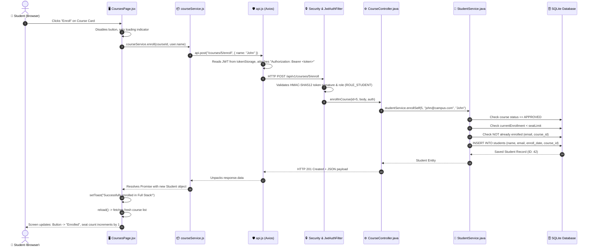
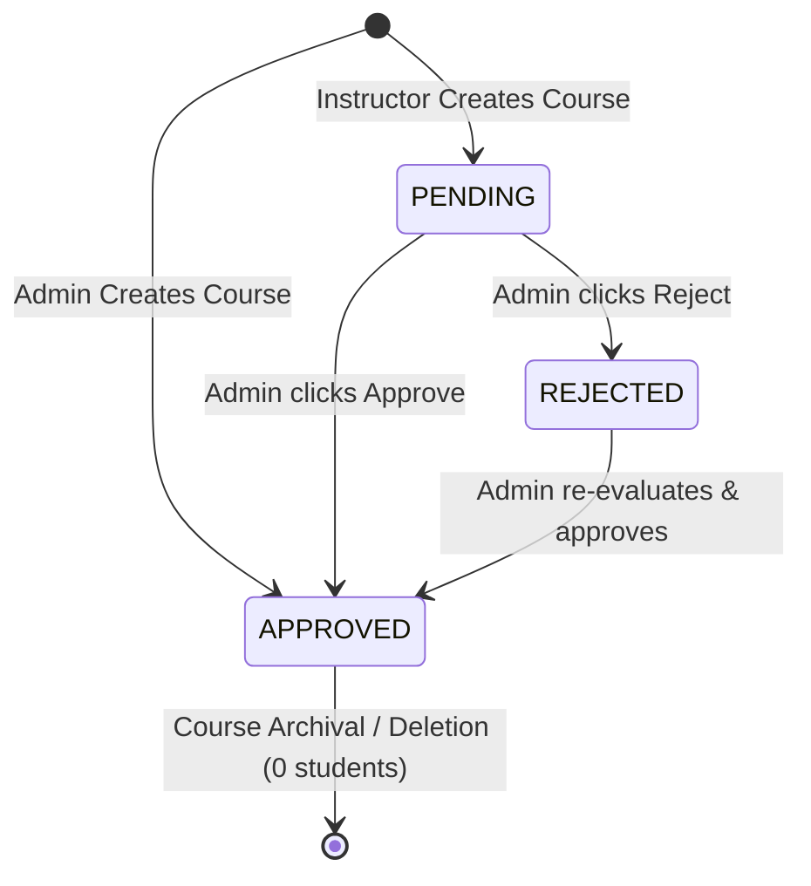

# 🎓 Master Guide: `courseService.js` End-to-End Architecture

Welcome to the definitive, end-to-end technical reference for **Course Management** in the Course Enrollment System. This guide traces every line of [`src/services/courseService.js`](file:///Users/manjesh/Desktop/Course/course/src/services/courseService.js) through its frontend UI callers, Axios interceptor networking layer, Spring Boot backend controller, business logic services, security guards, and database transactions.

---

## 📑 Table of Contents

1. [Architecture Overview & Complete Data Flow](#1-architecture-overview--complete-data-flow)
2. [🌟 Spotlight Feature: End-to-End Walkthrough (UI → Service → API → Response → Screen Update)](#2--spotlight-feature-end-to-end-walkthrough)
3. [Line-by-Line & Method-by-Method Breakdown](#3-line-by-line--method-by-method-breakdown)
    - [Method 1: `getCourses`](#method-1-getcourses)
    - [Method 2: `getMyCourses`](#method-2-getmycourses)
    - [Method 3: `getCourseById`](#method-3-getcoursebyid)
    - [Method 4: `getCourseStudents`](#method-4-getcoursestudents)
    - [Method 5: `createCourse`](#method-5-createcourse)
    - [Method 6: `updateCourse`](#method-6-updatecourse)
    - [Method 7: `enroll`](#method-7-enroll)
    - [Method 8: `approveCourse`](#method-8-approvecourse)
    - [Method 9: `rejectCourse`](#method-9-rejectcourse)
    - [Method 10: `deleteCourse`](#method-10-deletecourse)
4. [Role-Based Access Control (RBAC) Matrix](#4-role-based-access-control-rbac-matrix)
5. [Critical Business Rules & Integrity Safeguards](#5-critical-business-rules--integrity-safeguards)
6. [Frontend UI Integration (How Screens Consume the Service)](#6-frontend-ui-integration)
7. [Testing Strategy (Vitest & Mockito)](#7-testing-strategy)
8. [Top 10 Viva & Interview Defense Questions](#8-top-10-viva--interview-defense-questions)

---

## 1. Architecture Overview & Complete Data Flow

`courseService.js` is the **Client-Side Service Layer** for courses. It adheres strictly to the **Single Responsibility Principle**—UI components never construct raw HTTP queries or handle HTTP statuses directly; they delegate all course operations to this service.

```mermaid
flowchart TD
    subgraph UI_Layer["1. UI Components Layer"]
        CP[CoursesPage.jsx]
        CDP[CourseDetailPage.jsx]
        SP[StudentsPage.jsx]
        CFM[CourseFormModal.jsx]
    end

    subgraph Service_Layer["2. Frontend Service Layer"]
        CS[courseService.js]
    end

    subgraph Network_Layer["3. HTTP Network Layer"]
        API[api.js Axios Interceptor]
        TS[tokenStorage.js]
    end

    subgraph Backend_Controller["4. Spring Boot REST Controllers"]
        CC[CourseController.java]
    end

    subgraph Backend_Service["5. Business Logic & Security"]
        CServ[CourseService.java]
        SServ[StudentService.java]
    end

    subgraph Database_Layer["6. Spring Data JPA & SQLite"]
        CR[(CourseRepository)]
        SR[(StudentRepository)]
        DB[(SQLite Database: courses, students)]
    end

    CP & CDP & SP & CFM -->|Calls service methods| CS
    CS -->|api.get / post / patch / delete| API
    API -->|Reads JWT from| TS
    API -->|"HTTP Request + Authorization: Bearer &lt;JWT&gt;"| CC
    CC -->|@PreAuthorize RBAC Check| CServ
    CC -->|Enrollment delegation| SServ
    CServ --> CR
    SServ --> SR
    CR & SR --> DB
```

---

## 2. 🌟 Spotlight Feature: End-to-End Walkthrough

> **Examiner Question:** _"Pick one feature and explain it end-to-end: UI → service → API → response → screen update."_

Here is the complete end-to-end trace of the **"Student Self-Enrollment"** feature (`courseService.enroll(courseId, name)`):



### Detailed Step-by-Step Breakdown

#### Step 1: User Action in UI ([`CoursesPage.jsx`](file:///Users/manjesh/Desktop/Course/course/src/pages/CoursesPage.jsx#L186-L197))

1. The student navigates to the **Courses Catalog** and finds an approved course that has available seats.
2. Clicking the **"Enroll"** button executes the component handler:
    ```javascript
    async function handleEnroll(course) {
        try {
            await courseService.enroll(course.id, user?.name);
            setToast({
                message: `Successfully enrolled in "${course.name}"!`,
                type: "success",
            });
            reload(); // Refetches latest courses & updates UI
        } catch (err) {
            setToast({ message: err.message, type: "error" });
        }
    }
    ```

#### Step 2: Client Service Call ([`courseService.js`](file:///Users/manjesh/Desktop/Course/course/src/services/courseService.js#L87-L96))

1. `courseService.enroll(courseId, name)` formats the URL and payload:
    ```javascript
    async enroll(courseId, name) {
        const payload = name ? { name } : {};
        return api.post(API_ENDPOINTS.ENROLL(courseId), payload);
    }
    ```
2. Resolves `API_ENDPOINTS.ENROLL(5)` to `"/courses/5/enroll"`.

#### Step 3: Axios Interceptor & HTTP Network Layer ([`api.js`](file:///Users/manjesh/Desktop/Course/course/src/services/api.js#L26-L35))

1. Before the request leaves the browser, the Axios **Request Interceptor** fires:
    ```javascript
    api.interceptors.request.use((config) => {
        const token = tokenStorage.getToken();
        if (token) {
            config.headers.Authorization = `Bearer ${token}`;
        }
        return config;
    });
    ```
2. Injects `Authorization: Bearer eyJhbGciOi...` read from `tokenStorage`.
3. Dispatches HTTP POST to `http://localhost:3000/api/v1/courses/5/enroll`.

#### Step 4: Spring Boot Security & Controller ([`CourseController.java`](file:///Users/manjesh/Desktop/Course/course/backend/src/main/java/com/courseenrollment/course/controller/CourseController.java#L95-L108))

1. **Security Filter** (`JwtAuthFilter.java`):
    - Extracts Bearer token, verifies HMAC-SHA512 signature, loads user authorities.
    - Populates `SecurityContextHolder`.
2. **Controller Routing**:
    ```java
    @PostMapping("/{id}/enroll")
    @PreAuthorize("hasAnyRole('ADMIN', 'STUDENT')")
    public ResponseEntity<Student> enrollInCourse(
            @PathVariable Long id,
            @RequestBody(required = false) Map<String, String> body,
            Authentication auth
    ) {
        String email = auth != null ? auth.getName() : null;
        String name = (body != null && body.containsKey("name")) ? body.get("name") : email;
        Student student = studentService.enrollSelf(id, email, name);
        return ResponseEntity.status(HttpStatus.CREATED).body(student);
    }
    ```
3. `@PreAuthorize` verifies caller is authenticated with `ROLE_STUDENT` (or `ROLE_ADMIN`).
4. Extracts student email securely from `auth.getName()`.

#### Step 5: Business Validation & Transaction ([`StudentService.java`](file:///Users/manjesh/Desktop/Course/course/backend/src/main/java/com/courseenrollment/student/service/StudentService.java#L54-L116))

Inside a `@Transactional` block, the backend executes 5 critical business checks:

1. **Course Status Check**: Must be `CourseStatus.APPROVED`. If pending, throws `ConflictException("Course is not approved for enrollment.")`.
2. **Seat Capacity Check**: Checks `studentRepository.countByCourseId(5)`. If `enrolled >= seatLimit`, throws `ConflictException("Course is full. Cannot enroll more students.")`.
3. **Student Account Check**: Finds user by email in `userRepository`. Verifies `role == UserRole.STUDENT` and `status == UserStatus.ACTIVE`.
4. **Max Courses Check**: Verifies `countByEmailIgnoreCase(email) < maxCoursesPerStudent`.
5. **Duplicate Enrollment Check**: Verifies `existsByEmailIgnoreCaseAndCourseId(email, 5)`. If true, throws `ConflictException("Student is already enrolled in this course.")`.
6. **Persistence**:
    ```java
    Student student = new Student(studentName, email, LocalDate.now().toString(), course);
    return studentRepository.save(student);
    ```
    Saves to the `students` SQLite table and returns the entity.

#### Step 6: HTTP Response Generation

- Spring Boot returns **HTTP `201 Created`** with response body:
    ```json
    {
        "id": 42,
        "name": "John Doe",
        "email": "john@campus.com",
        "enrollDate": "2026-10-07",
        "course": {
            "id": 5,
            "name": "Full Stack React & Spring",
            "instructor": "Dr. Jane Smith",
            "seatLimit": 30,
            "status": "APPROVED"
        }
    }
    ```

#### Step 7: Response Interceptor & Screen Update

1. **Axios Response Interceptor** ([`api.js`](file:///Users/manjesh/Desktop/Course/course/src/services/api.js#L38-L40)) extracts `response.data` and resolves the promise.
2. **Success Toast**: `setToast({ message: 'Successfully enrolled in "Full Stack React & Spring"!', type: "success" })` renders a green notification banner at the top of the UI.
3. **Screen Reload**: `reload()` increments `refreshIndex`, triggering the component's `useEffect`:
    - Calls `courseService.getCourses(...)` to get fresh data from the server.
    - `courses` state updates:
        - Enrolled count increments (e.g. `14 / 30` $\rightarrow$ `15 / 30`).
        - Progress bar width recalculates to reflect the updated enrollment percentage.
        - The "Enroll" button toggles to an "Enrolled" badge.
        - If seat limit was reached (`30 / 30`), status badge automatically updates to `Full`.
4. **Error Handling (Failure Path)**:
    - If seat limit was full or already enrolled, backend returns `HTTP 409 Conflict`.
    - Axios catches the error and rejects the promise.
    - `catch (err)` runs: `setToast({ message: err.message, type: "error" })`.
    - The UI displays a red notification banner explaining the exact rejection reason without crashing.

---

## 3. Line-by-Line & Method-by-Method Breakdown

### Overview of Imports

```javascript
import { API_ENDPOINTS } from "@/constants/api";
import api from "@/services/api";
```

- **`API_ENDPOINTS`**: Centralized map of route templates (`COURSES: "/courses"`, `MY_COURSES: "/courses/my-courses"`, `COURSE_DETAIL: (id) => '/courses/${id}'`, etc.).
- **`api`**: The configured Axios instance with:
    - Base URL configuration (`http://localhost:3000/api/v1` or `/api/v1`).
    - **Request Interceptor**: Injects `Authorization: Bearer <token>` from `tokenStorage`.
    - **Response Interceptor**: Automatically unpacks `response.data` and handles silent JWT refresh on `401 Unauthorized`.

---

### Method 1: `getCourses`

```javascript
async getCourses({ page = 1, limit = 10, search = "", status = "" } = {}) {
    const params = { page, limit };
    if (search) params.search = search;
    if (status) params.status = status;
    return api.get(API_ENDPOINTS.COURSES, { params });
}
```

- **Purpose**: Fetches a paginated, searchable, status-filtered list of courses.
- **Parameters**:
    - `page` (number, default: 1): 1-indexed target page.
    - `limit` (number, default: 10): Items per page (server clamps between 1 and 50).
    - `search` (string, optional): Case-insensitive match against course name or instructor name.
    - `status` (string, optional): Filter by `pending`, `approved`, or `rejected`.
- **Frontend Caller**:
    - [`CoursesPage.jsx`](file:///Users/manjesh/Desktop/Course/course/src/pages/CoursesPage.jsx#L68-L80): Main catalog list.
    - [`StudentsPage.jsx`](file:///Users/manjesh/Desktop/Course/course/src/pages/StudentsPage.jsx#L49-L53): Calls `getCourses({ status: 'approved', limit: 100 })` to populate enrollment dropdowns.
- **Backend Mapping**:
    - `CourseController.java`: `GET /courses`
    - `CourseService.java`: `findAll(page, limit, search, status, email, roleStr)`
- **Role-Aware Visibility (Crucial Backend Logic)**:
    - **`ADMIN`**: Can see **all** courses or filter by any status (`approved`, `pending`, `rejected`).
    - **`INSTRUCTOR`**: Sees all `APPROVED` courses **plus their own `PENDING` courses** so they can track approval progress.
    - **`STUDENT` / Anonymous**: Restricted strictly to `APPROVED` courses (`CourseStatus.APPROVED`). Unapproved drafts are invisible.

---

### Method 2: `getMyCourses`

```javascript
async getMyCourses({ page = 1, limit = 10 } = {}) {
    return api.get(API_ENDPOINTS.MY_COURSES, { params: { page, limit } });
}
```

- **Purpose**: Retrieves personalized courses specific to the logged-in user identity.
- **Frontend Caller**:
    - [`CoursesPage.jsx`](file:///Users/manjesh/Desktop/Course/course/src/pages/CoursesPage.jsx#L42-L46): Triggered when user selects the "My Courses" tab.
- **Backend Mapping**:
    - `CourseController.java`: `GET /courses/my-courses` (`@PreAuthorize("isAuthenticated()")`)
    - `CourseService.java`: `getMyCourses(email, roleStr, page, limit)`
- **Dynamic Context Handling**:
    - If user is **`STUDENT`**: Executes `studentRepository.findEnrolledCoursesByEmail(userEmail, pageable)` to return only courses the student is actively enrolled in.
    - If user is **`INSTRUCTOR`**: Executes `courseRepository.findByInstructorEmail(userEmail, pageable)` to return courses created by this instructor.
    - If user is **`ADMIN`**: Returns all courses.

---

### Method 3: `getCourseById`

```javascript
async getCourseById(id) {
    return api.get(API_ENDPOINTS.COURSE_DETAIL(id));
}
```

- **Purpose**: Fetches complete detail for a single course entity.
- **Frontend Caller**:
    - [`CourseDetailPage.jsx`](file:///Users/manjesh/Desktop/Course/course/src/pages/CourseDetailPage.jsx#L44): Loaded on mount when user navigates to `/courses/:id`.
- **Backend Mapping**:
    - `CourseController.java`: `GET /courses/{id}`
    - `CourseService.java`: `findOne(Long id)`
    - Throws `ResourceNotFoundException("Course with ID " + id + " not found")` (HTTP 404) if not found.

---

### Method 4: `getCourseStudents`

```javascript
async getCourseStudents(courseId, { page = 1, limit = 10 } = {}) {
    return api.get(API_ENDPOINTS.COURSE_STUDENTS(courseId), {
        params: { page, limit },
    });
}
```

- **Purpose**: Retrieves the roster of students enrolled in a specific course.
- **Frontend Caller**:
    - [`CourseDetailPage.jsx`](file:///Users/manjesh/Desktop/Course/course/src/pages/CourseDetailPage.jsx#L65): Populates the "Enrolled Students" roster table.
- **Backend Mapping**:
    - `CourseController.java`: `GET /courses/{id}/students` (`@PreAuthorize("hasAnyRole('ADMIN', 'INSTRUCTOR', 'STUDENT')")`)
- **Privacy & Security Safeguards**:
    - **`ADMIN`**: Full access to all course rosters.
    - **`INSTRUCTOR`**: Allowed only if `course.instructorEmail` matches `auth.name`. Otherwise throws 403 Forbidden.
    - **`STUDENT`**: Allowed only if `studentService.isStudentEnrolled(currentUserEmail, courseId)` is true (can only view peers in courses they attend). Otherwise throws 403 Forbidden.

---

### Method 5: `createCourse`

```javascript
async createCourse(data) {
    return api.post(API_ENDPOINTS.COURSES, data);
}
```

- **Purpose**: Creates a new course in the system.
- **Payload (`data`)**:
    - `name`: Course title (string, e.g., `"Cloud Architecture"`).
    - `instructor`: Instructor name (or instructor email).
    - `seatLimit`: Max enrollment capacity (integer, e.g., `30`).
- **Frontend Caller**:
    - [`CoursesPage.jsx`](file:///Users/manjesh/Desktop/Course/course/src/pages/CoursesPage.jsx#L116) via `CourseFormModal.jsx`.
- **Backend Mapping**:
    - `CourseController.java`: `POST /courses` (`@PreAuthorize("hasAnyRole('ADMIN', 'INSTRUCTOR')")`)
    - `CourseService.java`: `create(CreateCourseRequest req, String userEmail, UserRole role)`
- **Business Logic Enforced**:
    - **Auto-Status Assignment**:
        - Created by **`INSTRUCTOR`** $\rightarrow$ Initial status is `PENDING`.
        - Created by **`ADMIN`** $\rightarrow$ Initial status is `APPROVED`.
    - **Instructor Identity Binding**:
        - When an instructor creates a course, their email is automatically assigned as `instructorEmail`.
        - When an Admin creates a course, the assigned instructor **must be an existing active user with role `INSTRUCTOR`** (an Admin cannot assign themselves as instructor).

---

### Method 6: `updateCourse`

```javascript
async updateCourse(id, data) {
    return api.patch(API_ENDPOINTS.COURSE_DETAIL(id), data);
}
```

- **Purpose**: Edits course attributes (name, instructor, seat limit, status).
- **Frontend Caller**:
    - [`CoursesPage.jsx`](file:///Users/manjesh/Desktop/Course/course/src/pages/CoursesPage.jsx#L110) via edit modal.
- **Backend Mapping**:
    - `CourseController.java`: `PATCH /courses/{id}` (`@PreAuthorize("hasAnyRole('ADMIN', 'INSTRUCTOR')")`)
    - `CourseService.java`: `update(Long id, UpdateCourseRequest req)`
- **Integrity Safeguards**:
    - **Ownership Guard**: Instructors can only edit their own courses (`isOwner` check).
    - **Status Shield**: Instructors cannot change status directly; only Admins can alter status.
    - **Seat Reduction Conflict**: If the new `seatLimit` is lower than the current enrolled student count, the backend rejects it with **HTTP 409 Conflict**:
        ```text
        "Cannot reduce seat limit to 15. 18 student(s) currently enrolled."
        ```

---

### Method 7: `enroll`

```javascript
async enroll(courseId, name) {
    const payload = name ? { name } : {};
    return api.post(API_ENDPOINTS.ENROLL(courseId), payload);
}
```

- **Purpose**: Allows the authenticated student to self-enroll in an approved course.
- **Frontend Caller**:
    - [`CoursesPage.jsx`](file:///Users/manjesh/Desktop/Course/course/src/pages/CoursesPage.jsx#L188) (Quick "Enroll" button on course cards/rows).
    - [`CourseDetailPage.jsx`](file:///Users/manjesh/Desktop/Course/course/src/pages/CourseDetailPage.jsx#L121) ("Enroll Now" action button).
- **Backend Mapping**:
    - `CourseController.java`: `POST /courses/{id}/enroll` (`@PreAuthorize("hasAnyRole('ADMIN', 'STUDENT')")`)
    - `StudentService.java`: `enrollSelf(id, email, name)`
- **Rigorous Business Validations**:
    1. **Approval Check**: Course status must be `APPROVED`. Cannot enroll in `PENDING` or `REJECTED` courses (HTTP 409).
    2. **Capacity Check**: `currentEnrollment < seatLimit`. If full, throws `ConflictException("Course is full.")`.
    3. **Duplicate Check**: Checks composite unique key `(email, course_id)`. If student is already enrolled, throws `ConflictException("Student is already enrolled in this course.")`.
    4. **Active Account Check**: User must have role `STUDENT` and status `ACTIVE`.
    5. **Max Courses Limit**: Checks `countByEmailIgnoreCase(email) < maxCoursesPerStudent` (configurable via `application.yml`).

---

### Method 8: `approveCourse`

```javascript
async approveCourse(courseId) {
    return api.patch(API_ENDPOINTS.APPROVE_COURSE(courseId));
}
```

- **Purpose**: Transition course status from `PENDING` (or `REJECTED`) to `APPROVED`.
- **Frontend Caller**:
    - [`CoursesPage.jsx`](file:///Users/manjesh/Desktop/Course/course/src/pages/CoursesPage.jsx#L162) (Green checkmark action button).
    - [`CourseDetailPage.jsx`](file:///Users/manjesh/Desktop/Course/course/src/pages/CourseDetailPage.jsx#L98) ("Approve Course" button).
- **Backend Mapping**:
    - `CourseController.java`: `PATCH /courses/{id}/approve` (`@PreAuthorize("hasRole('ADMIN')")`)
    - `CourseService.java`: `approve(id)` $\rightarrow$ sets `course.setStatus(CourseStatus.APPROVED)` and persists.

---

### Method 9: `rejectCourse`

```javascript
async rejectCourse(courseId) {
    return api.patch(API_ENDPOINTS.REJECT_COURSE(courseId));
}
```

- **Purpose**: Transition course status from `PENDING` to `REJECTED`.
- **Frontend Caller**:
    - [`CoursesPage.jsx`](file:///Users/manjesh/Desktop/Course/course/src/pages/CoursesPage.jsx#L175) (Red cross action button).
    - [`CourseDetailPage.jsx`](file:///Users/manjesh/Desktop/Course/course/src/pages/CourseDetailPage.jsx#L111) ("Reject Course" button).
- **Backend Mapping**:
    - `CourseController.java`: `PATCH /courses/{id}/reject` (`@PreAuthorize("hasRole('ADMIN')")`)
    - `CourseService.java`: `reject(id)` $\rightarrow$ sets `course.setStatus(CourseStatus.REJECTED)` and persists.

---

### Method 10: `deleteCourse`

```javascript
async deleteCourse(courseId) {
    return api.delete(API_ENDPOINTS.COURSE_DETAIL(courseId));
}
```

- **Purpose**: Permanently deletes a course entity.
- **Frontend Caller**:
    - [`CoursesPage.jsx`](file:///Users/manjesh/Desktop/Course/course/src/pages/CoursesPage.jsx#L144) (Delete confirmation modal).
- **Backend Mapping**:
    - `CourseController.java`: `DELETE /courses/{id}` (`@PreAuthorize("hasRole('ADMIN')")`)
    - `CourseService.java`: `remove(Long id)`
- **Deletion Safeguard (Zero Data Loss Protection)**:
    ```java
    long enrolledCount = studentRepository.countByCourseId(id);
    if (enrolledCount > 0) {
        throw new ConflictException(
            "Cannot delete course with active student enrollments. Please unenroll all students first."
        );
    }
    ```
    The course cannot be deleted while students are enrolled in it. This prevents foreign key constraint violations and accidental data loss.

---

## 3. Role-Based Access Control (RBAC) Matrix

| Method                   | Endpoint                      |             Admin             |        Instructor         |         Student         |       Public        |
| :----------------------- | :---------------------------- | :---------------------------: | :-----------------------: | :---------------------: | :-----------------: |
| `getCourses()`           | `GET /courses`                |      ✅ All / Any Status      | ✅ Approved + Own Pending |    ✅ Approved Only     |  ✅ Approved Only   |
| `getMyCourses()`         | `GET /courses/my-courses`     |        ✅ All Courses         |  ✅ Own Created Courses   | ✅ Own Enrolled Courses | ❌ 401 Unauthorized |
| `getCourseById(id)`      | `GET /courses/{id}`           |          ✅ Allowed           |        ✅ Allowed         |       ✅ Allowed        |     ✅ Allowed      |
| `getCourseStudents(id)`  | `GET /courses/{id}/students`  |        ✅ All Courses         |    ✅ Own Course Only     | ✅ Enrolled Course Only | ❌ 401 Unauthorized |
| `createCourse(data)`     | `POST /courses`               |    ✅ Initial: `APPROVED`     |   ✅ Initial: `PENDING`   |    ❌ 403 Forbidden     | ❌ 401 Unauthorized |
| `updateCourse(id, data)` | `PATCH /courses/{id}`         |         ✅ Any Course         | ✅ Own Course (No status) |    ❌ 403 Forbidden     | ❌ 401 Unauthorized |
| `enroll(courseId)`       | `POST /courses/{id}/enroll`   |          ✅ Allowed           |     ❌ 403 Forbidden      |       ✅ Allowed        | ❌ 401 Unauthorized |
| `approveCourse(id)`      | `PATCH /courses/{id}/approve` |          ✅ Allowed           |     ❌ 403 Forbidden      |    ❌ 403 Forbidden     | ❌ 401 Unauthorized |
| `rejectCourse(id)`       | `PATCH /courses/{id}/reject`  |          ✅ Allowed           |     ❌ 403 Forbidden      |    ❌ 403 Forbidden     | ❌ 401 Unauthorized |
| `deleteCourse(id)`       | `DELETE /courses/{id}`        | ✅ Allowed (if 0 enrollments) |     ❌ 403 Forbidden      |    ❌ 403 Forbidden     | ❌ 401 Unauthorized |

---

## 4. Critical Business Rules & Integrity Safeguards

### 1. Course Approval Lifecycle (State Machine)



### 2. Enrollment Capacity Enforcement

- **Seat Limit Validation**: When an enrollment request arrives, `StudentService` queries `studentRepository.countByCourseId(courseId)`.
- If `currentEnrollment >= course.getSeatLimit()`, the request is rejected with a `409 Conflict`.
- Frontend displays a full badge (`Full`) and disables the "Enroll" button when `enrolledCount >= seatLimit`.

### 3. Deletion Safeguard

- A course with active student records cannot be deleted.
- Admin must unenroll all students from the Students tab before deleting the course.

### 4. Search and Pagination Envelope

Both search and pagination are handled server-side to guarantee scalability:

```json
{
    "data": [
        {
            "id": 1,
            "name": "Full Stack React & Spring",
            "instructor": "Dr. Jane Smith",
            "instructorEmail": "jane@campus.com",
            "seatLimit": 30,
            "enrolledCount": 14,
            "status": "APPROVED",
            "createdAt": "2026-10-01T10:00:00Z"
        }
    ],
    "meta": {
        "total": 45,
        "page": 1,
        "limit": 10,
        "totalPages": 5
    }
}
```

---

## 5. Frontend UI Integration

### In `CoursesPage.jsx`:

- **Tabs**: "All Courses" calls `courseService.getCourses(...)`; "My Courses" calls `courseService.getMyCourses(...)`.
- **Search Bar**: Debounced input triggers `courseService.getCourses({ search: query, page: 1 })`.
- **Dynamic Action Badges**:
    - `canApproveCourse(user)` reveals the Approve and Reject buttons.
    - `canCreateCourse(user)` displays the "+ Add Course" button.
    - `canEnroll(user)` displays the "Enroll" button on available courses.

### In `CourseDetailPage.jsx`:

- Loads full course details via `courseService.getCourseById(courseId)`.
- Visual seat capacity bar:
  $$\text{Capacity \%} = \frac{\text{course.enrolledCount}}{\text{course.seatLimit}} \times 100$$
- Displays enrolled student roster using `courseService.getCourseStudents(courseId)`.

---

## 6. Testing Strategy

### Frontend Vitest ([`courseService.test.js`](file:///Users/manjesh/Desktop/Course/course/src/services/courseService.test.js))

- Tests mock `api.get`, `api.post`, `api.patch`, `api.delete` to verify:
    1. Correct query parameters (`page`, `limit`, `search`, `status`) passed to `api.get`.
    2. `createCourse` sends correct JSON payload.
    3. `enroll` correctly constructs path `/courses/{id}/enroll`.
    4. `approveCourse` and `rejectCourse` call expected PATCH endpoints.

### Backend JUnit 5 & Mockito (`CourseServiceTest.java`)

- 20 comprehensive unit tests verifying:
    - Role-based initial status assignment (`PENDING` vs `APPROVED`).
    - Instructor ownership verification on course update.
    - Rejection of seat limit reduction below current enrollments.
    - Conflict exception on deleting course with enrolled students.
    - Search filtering by status and keywords.

---

## 7. Top 10 Viva & Interview Defense Questions

### Q1: Why encapsulate API calls in `courseService.js` instead of using `fetch()` directly in React components?

> **Answer:** _"Separation of Concerns. UI components should only handle view state, rendering, and user events. Moving network requests to a service layer eliminates duplicate code, centralizes API endpoint management, ensures all calls pass through our Axios interceptors for JWT injection, and makes components easy to test with mock services."_

### Q2: What happens when an instructor creates a course vs when an admin creates a course?

> **Answer:** _"The backend checks the caller's role from the JWT token. If the caller has role `INSTRUCTOR`, the course is assigned `status = PENDING` and requires admin approval before students can see it. If the caller is `ADMIN`, the course is immediately set to `APPROVED`."_

### Q3: How do you prevent a student from seeing unapproved courses?

> **Answer:** _"Security is enforced at the database query level in `CourseService.java`. When a student or public user requests courses via `GET /courses`, the query is hard-filtered to `status = 'APPROVED'`. Even if an unauthenticated user calls the API directly via Postman, pending courses are never returned in the response payload."_

### Q4: How is seat limit overbooking prevented?

> **Answer:** _"When `courseService.enroll(courseId)` is invoked, `StudentService.java` runs inside an `@Transactional` block. It calculates `studentRepository.countByCourseId(courseId)`. If this count meets or exceeds `course.getSeatLimit()`, a `ConflictException` (HTTP 409) is thrown with message 'Course is full'."_

### Q5: Can an admin reduce the seat limit of a course from 50 to 20 if 25 students are already enrolled?

> **Answer:** _"No. In `CourseService.update()`, the backend checks `if (req.getSeatLimit() < currentEnrollment)`. If violated, it throws a 409 Conflict explaining that the limit cannot be set below the active enrollment count."_

### Q6: Can an admin delete a course that already has enrolled students?

> **Answer:** _"No. In `courseService.remove(id)`, the backend checks `studentRepository.countByCourseId(id)`. If count > 0, it aborts deletion and throws a 409 Conflict error requiring the admin to unenroll all students first, preserving referential integrity."_

### Q7: What is the difference between `getCourses()` and `getMyCourses()`?

> **Answer:** _"`getCourses()` returns the public course catalog (paginated and searchable). `getMyCourses()` returns courses contextually relevant to the logged-in user: enrolled courses for students, created courses for instructors, or all courses for admins."_

### Q8: What happens if an instructor tries to edit someone else's course?

> **Answer:** _"In `CourseController.update()`, if the user has role `INSTRUCTOR`, the controller compares `course.getInstructorEmail()` with the caller's email from the JWT (`auth.getName()`). If they do not match, it throws `AccessDeniedException` (HTTP 403 Forbidden)."_

### Q9: Can an instructor change the status of their course to 'APPROVED' via API?

> **Answer:** _"No. The controller checks `if (req.getStatus() != null && role == UserRole.INSTRUCTOR)`, throwing an `AccessDeniedException`. Status modification is strictly restricted to Admin endpoints (`/approve`, `/reject`, `/status`)."_

### Q10: Why does `courseService.updateCourse` use `PATCH` instead of `PUT`?

> **Answer:** _"`PUT` implies replacing the entire resource representation, requiring all fields to be supplied. `PATCH` is designed for partial updates, allowing us to update only `seatLimit` or `name` without re-submitting unchanged fields."_
