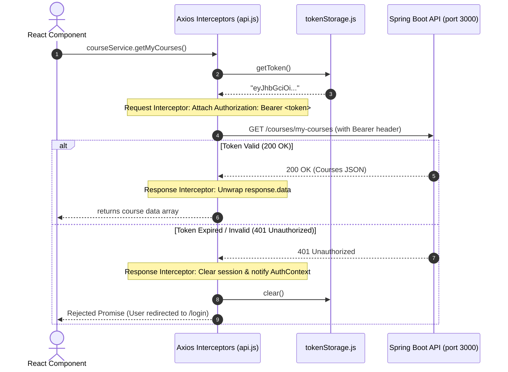

# Day 2 Technical Report: Token Storage, Backend Integration & RBAC Exploration

## 1. Executive Summary

This document details the architectural decisions, security trade-offs, and implementation strategies developed for **Day 2: Backend Integration, Authentication & Role-Based Access Control (RBAC)** in the Course Enrollment system.

The implementation connects the React frontend directly to the Spring Boot REST backend through an Axios HTTP client layer, featuring automatic token attachment, centralized 401 session expiration handling, an isolated storage abstraction, and role-based UI and route protections.

---

## 2. Token Storage Options & Trade-Off Analysis

Storing JWT authentication tokens in a client-side web application presents critical security and usability trade-offs. The three primary mechanisms are evaluated below:

### 2.1 Storage Mechanism Comparison

| Feature / Metric              | `localStorage`                                                                                 | `sessionStorage`                                                                              | `httpOnly Cookies`                                                                                                    |
| :---------------------------- | :--------------------------------------------------------------------------------------------- | :-------------------------------------------------------------------------------------------- | :-------------------------------------------------------------------------------------------------------------------- |
| **Persistence**               | Persists across browser restarts until explicitly cleared.                                     | Cleared immediately when the browser tab/window is closed.                                    | Configurable via `Expires` / `Max-Age` header attributes.                                                             |
| **Multi-Tab Sharing**         | Shared across all tabs and windows for the same origin.                                        | Isolated to the specific browser tab where session originated.                                | Automatically sent with requests across all tabs on that domain.                                                      |
| **Vulnerability to XSS**      | **Vulnerable**: Any malicious JavaScript running in the origin can read `localStorage`.        | **Vulnerable**: Any malicious JavaScript can read `sessionStorage` in that tab.               | **Immune**: Inaccessible to JavaScript via `document.cookie` if `HttpOnly` flag is set.                               |
| **Vulnerability to CSRF**     | **Immune**: Browsers do not automatically attach `localStorage` values to cross-site requests. | **Immune**: Browsers do not automatically attach `sessionStorage` to cross-site requests.     | **Vulnerable**: Browsers automatically send cookies with cross-site requests unless mitigated.                        |
| **Implementation Complexity** | Simple: Standard JavaScript API, explicitly passed in `Authorization: Bearer <token>` header.  | Simple: Standard JavaScript API, explicitly passed in `Authorization: Bearer <token>` header. | Moderate to High: Requires server-side `Set-Cookie`, CORS `credentials: include`, SameSite policies, and CSRF tokens. |

### 2.2 Security Considerations: XSS vs. CSRF

1. **Cross-Site Scripting (XSS):**
    - If an application suffers from an XSS vulnerability, an attacker can execute arbitrary scripts in the victim's browser context.
    - If tokens are in `localStorage` or `sessionStorage`, an attacker can exfiltrate `localStorage.getItem("course_auth_token")`.
    - **Mitigation:** Strict Content Security Policy (CSP), avoiding `dangerouslySetInnerHTML`, escaping all dynamic content, and validating all inputs with Zod schemas.

2. **Cross-Site Request Forgery (CSRF):**
    - If authentication relies solely on ambient cookies, a malicious third-party website can forge requests to the authenticated backend on behalf of the user.
    - **Mitigation:** Requires `SameSite=Strict` or `SameSite=Lax` cookies, custom request headers (e.g. `X-Requested-With`), or double-submit CSRF tokens.
    - Bearer tokens stored in client storage and attached explicitly via HTTP headers (`Authorization: Bearer <token>`) are inherently immune to CSRF because third-party websites cannot force the victim's browser to construct and attach the custom header.

### 2.3 Selected Approach & Architectural Rationale

For the Course Enrollment system, **`localStorage` accessed exclusively through the `tokenStorage.js` service module** was chosen for the following reasons:

- **Seamless Multi-Tab Experience:** Students and instructors opening course links in new tabs maintain their active authenticated session without requiring repeated logins.
- **RESTful Stateless Architecture:** Aligns with standard OAuth2 / OpenID Connect Bearer token patterns where the backend server remains stateless and decoupled from browser cookie management.
- **Strict Isolation (Single Responsibility Principle):** Direct access to `localStorage` is forbidden across all components, pages, and hooks. Only `src/services/tokenStorage.js` touches storage keys. If the enterprise later transitions to HttpOnly cookies or in-memory storage with refresh tokens, **only `tokenStorage.js` requires modification**, leaving the rest of the application completely untouched.

---

## 3. Axios Interceptor Architecture

The HTTP client (`src/services/api.js`) centralizes request configuration, token injection, and response processing using Axios interceptors.



### 3.1 Request Interceptor

- Before each outgoing HTTP request, the interceptor calls `tokenStorage.getToken()`.
- If a valid token string exists, it sets `config.headers.Authorization = "Bearer " + token`.
- This eliminates the need to manually pass authentication headers in individual service calls.

### 3.2 Response Interceptor

- **Data Unwrapping:** Automatically unwraps Axios responses, returning `response.data` directly to callers.
- **Centralized 401 Handling:** When an API call fails with status `401 Unauthorized` (such as when a JWT expires), the interceptor:
    1. Calls `tokenStorage.clear()` to purge stale credentials.
    2. Invokes the `onAuthError` callback registered by `AuthProvider`, which updates the global React state and redirects the user to `/login`.
- **Error Normalization:** Converts backend validation message arrays (e.g. `["seatLimit should not be empty", "name is required"]`) into human-readable strings and preserves the HTTP status code.

---

## 4. Role-Based Access Control (RBAC) Exploration

### 4.1 System Roles & Capabilities

The platform defines three distinct user roles:

| Role             | Permissions & System Capabilities                                                                                                                                                            |
| :--------------- | :------------------------------------------------------------------------------------------------------------------------------------------------------------------------------------------- |
| **`ADMIN`**      | Full platform authority: View all courses, review and approve/reject pending instructor courses, create courses directly with pre-approved status, delete courses, and enroll in any course. |
| **`INSTRUCTOR`** | Teaching authority: View created courses, submit new courses for admin approval (initial status: `PENDING`), track student enrollments in assigned courses.                                  |
| **`STUDENT`**    | Learning authority: Browse approved courses, self-enroll into courses within seat capacity, view enrolled courses under "My Enrolled Courses".                                               |

### 4.2 How Roles are Encoded & Verified

1. **Database & Entity Layer:**
    - The user record contains a `role` field (`admin`, `instructor`, `student`).
    - When a user registers through public registration, `AuthService.java` enforces that new accounts are always created as `STUDENT` (preventing privilege escalation).

2. **JWT Token Claims:**
    - On successful login (`POST /auth/login`), the server embeds `email`, `role`, and subject ID inside the signed JWT claims:
        ```json
        {
            "sub": "1",
            "email": "student@campus.com",
            "role": "student",
            "iat": 1790770812,
            "exp": 1790857212
        }
        ```

3. **Backend Enforcement (Spring Security):**
    - `JwtAuthFilter.java` validates token signature and maps the JWT `role` claim to Spring Security's `GrantedAuthority` as `ROLE_ADMIN`, `ROLE_INSTRUCTOR`, or `ROLE_STUDENT`.
    - Controller methods enforce access rules via `@PreAuthorize`:
        - `@PreAuthorize("hasRole('ADMIN')")`: Course approval, rejection, and deletion.
        - `@PreAuthorize("hasAnyRole('ADMIN', 'INSTRUCTOR')")`: Course creation and modification.
        - `@PreAuthorize("hasAnyRole('ADMIN', 'STUDENT')")`: Student enrollment.
        - `@PreAuthorize("isAuthenticated()")`: Personal dashboard (`/courses/my-courses`).

4. **Frontend Route & UI Gating:**
    - **`ProtectedRoute.jsx`:** Restricts navigation to authenticated users and verifies `allowedRoles`. Unauthorized access triggers an "Access Denied" view.
    - **`src/utils/permissions.js`:** Pure helper functions (`canCreateCourse`, `canApproveCourse`, `canEnroll`) condition UI elements (buttons, modals, tabs).
    - **Defense in Depth Principle:** Client-side permission checks are purely a UX affordance to prevent user frustration. The Spring Boot backend independently enforces authorization on every single API request.

### 4.3 Interactive Role Switching for Verification

To facilitate instant testing of all three roles without repeated credential logins, the system supports a role-switching mechanism:

- Backend: `POST /auth/switch-role` updates the user's role and issues a freshly signed JWT with the new role claim.
- Frontend: The `Header` component includes a `Switch Role` action that invokes `useAuth().switchRole()`, immediately reflecting the new role badge and updating dashboard capabilities in real time.

---

## 5. Verification & Quality Gates

The implementation adheres to all coding standards specified in `inst.md`:

- **Linter:** `npm run lint` — 0 errors, 0 warnings.
- **Code Formatter:** `npm run format:check` — 100% compliant with Prettier.
- **Test Suite:** `npm test` — 44 Vitest tests passing across schemas, storage, interceptors, services, and permissions.
- **Production Build:** `npm run build` — Clean Vite production bundle generated without errors.
