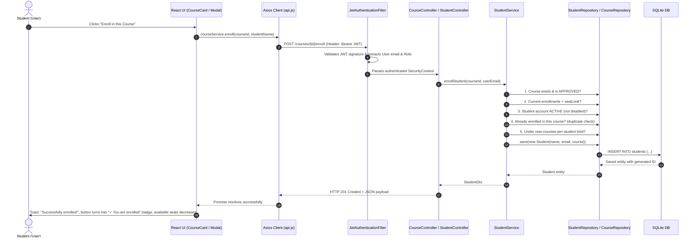
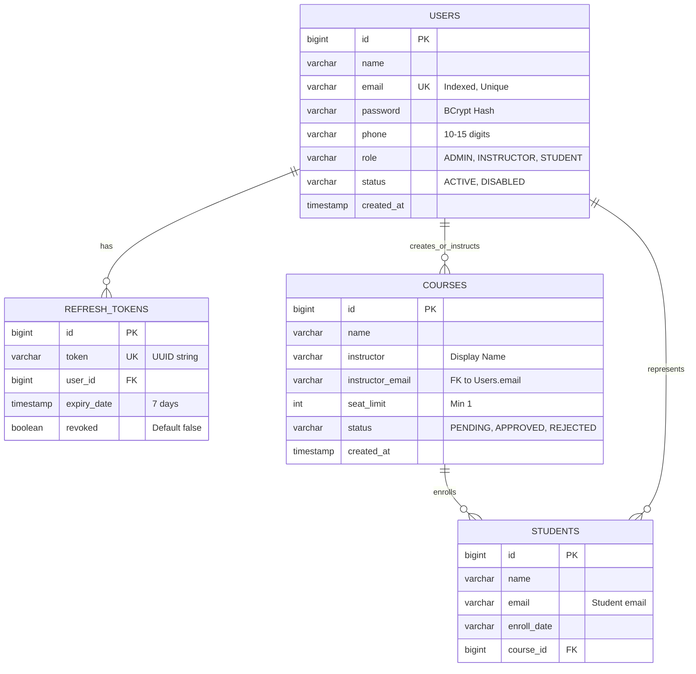

# 🎓 Course Enrollment System — Viva & Presentation Master Guide

> **How to use this guide:** Read this from top to bottom. It connects all the pieces of your project into one clear story. Each section gives you exact talking points, explanations of _why_ choices were made, and ready-to-use answers for examiners.

---

## 📌 Quick Project Snapshot (Cheat Sheet)

| Layer               | Technology                                                 | Key Responsibility                                                       |
| ------------------- | ---------------------------------------------------------- | ------------------------------------------------------------------------ |
| **Frontend**        | React 19 + Vite                                            | Fast Single Page Application (SPA), responsive UI, client-side routing   |
| **Styling**         | Vanilla CSS (CSS Variables)                                | Modern design tokens, fast rendering, zero bulky framework overhead      |
| **Form Validation** | Zod                                                        | Immediate client-side input validation and error hints                   |
| **API Client**      | Axios (with Interceptors)                                  | Centralized HTTP requests, automatic JWT injection, silent token refresh |
| **Backend**         | Spring Boot 3.3.3 (Java 17)                                | RESTful API, Domain-Driven Service layer, business validation            |
| **Security**        | Spring Security 6 + JWT                                    | Stateless authentication, HMAC-SHA512 token signing, method-level RBAC   |
| **Database**        | SQLite + Spring Data JPA                                   | Relational persistence, lightweight, self-contained single file          |
| **Testing**         | Vitest (UI) + JUnit 5/Mockito (Backend) + Newman (Postman) | 62 UI tests, 69 Backend tests, 44 Automated API integration tests        |

---

## 📑 Table of Contents

1. [⏱️ Section 1: 1–2 Minute Project Overview (What to Say Out Loud)](#-section-1-12-minute-project-overview-what-to-say-out-loud)
2. [📂 Section 2: Folder Structure & Architecture Rationale](#-section-2-folder-structure--why-its-organized-that-way)
3. [🔄 Section 3: Feature Walkthrough End-to-End (Student Enrollment)](#-section-3-feature-walkthrough-end-to-end-student-course-enrollment)
4. [🔐 Section 4: Auth Flow & Role-Based Access Control (RBAC)](#-section-4-auth-flow--role-based-access-control-rbac)
5. [🛡️ Section 5: Key Business Rules & Guardrails](#-section-5-key-business-rules--guardrails)
6. [❓ Section 6: Top 15 "Why" Questions & Trap Viva Questions](#-section-6-top-15-why-questions--trap-viva-questions)
7. [💻 Section 7: Live Code Change Cheat Sheet](#-section-7-live-code-change-cheat-sheet)
8. [📋 Section 8: Honesty Checklist (Done vs Future Scope)](#-section-8-honesty-checklist-what-is-done-vs-future-scope)
9. [🎯 Section 9: Demo Day Playbook (Live Demo Script & Test Accounts)](#-section-9-demo-day-playbook-live-demo-script--test-accounts)
10. [🚀 Section 10: Run & Verification Commands Checklist](#-section-10-run--verification-commands-checklist)
11. [🗄️ Section 11: Relational Database Schema & ER Diagram](#️-section-11-relational-database-schema--er-diagram)
12. [🗺️ Section 12: Feature-to-Code Traceability Matrix](#️-section-12-feature-to-code-traceability-matrix)

---

## ⏱️ Section 1: 1–2 Minute Project Overview (What to Say Out Loud)

> **Spoken Script (Memorize this flow):**
>
> _"Good morning / afternoon. My project is a **Full-Stack Course Enrollment and Academic Management System** built with **React 19** on the frontend and **Spring Boot 3** on the backend, using **SQLite** for relational persistence._
>
> _The system solves the problem of academic course registration by enforcing strict **Role-Based Access Control (RBAC)** across three distinct personas:_
>
> 1. _**Admin**: Oversees the entire portal — approves or rejects proposed courses, manages user accounts (activating or disabling students/instructors), and has master control over enrollments._
> 2. _**Instructor**: Creates new course proposals (which stay in a pending state until admin approved), edits their course details, and monitors the student roster for their assigned courses._
> 3. _**Student**: Explores approved courses, self-enrolls with real-time seat limit enforcement, views classmate rosters for courses they take, and manages their profile._
>
> _Technically, the application features **dual-token authentication** (short-lived JWT access tokens and database-backed rolling refresh tokens), **atomic seat limit and enrollment guardrails**, and **proactive UI filtering** so users never see options that would lead to invalid actions."_

---

## 📂 Section 2: Folder Structure & Why It's Organized That Way

### 1. Frontend Structure (`src/`)

```text
src/
├── components/          # Reusable, domain-agnostic UI building blocks
│   ├── common/          # Button, Modal, Alert, Badge, Pagination, SearchBar, Toast
│   └── layout/          # AppLayout, Navbar, Sidebar, ProtectedRoute
├── features/            # Feature-Sliced Architecture (High Cohesion)
│   ├── auth/            # Login/Register forms, password rules, Zod schemas
│   ├── courses/         # CourseCard, CourseTable, CourseFormModal
│   └── students/        # StudentTable, UserDirectoryTable, Enroll/Edit Modals
├── hooks/               # Custom hooks (e.g. useAuth for role/token state)
├── context/             # AuthContext providing global session state
├── services/            # API Service Layer (Axios HTTP client & interceptors)
│   ├── api.js           # Base axios instance with request & response interceptors
│   ├── authService.js   # Login, register, profile, token refresh calls
│   ├── courseService.js # Course CRUD, approve/reject, student enrollment
│   ├── studentService.js# Enrollment records management
│   └── userService.js   # User directory and status toggle calls
├── pages/               # Route-level container components (CoursesPage, ProfilePage, etc.)
└── utils/               # Helper utilities (permissions.js, dateUtils.js)
```

**Why this frontend structure?**

- **Feature-Sliced (`features/`) instead of flat folders**: Instead of putting 20 unrelated modals into one folder, components belonging to _Courses_ or _Students_ live together. This provides **high cohesion**, makes code easy to locate, and scales cleanly if the team grows.
- **Separation of Services (`services/`) from UI**: UI components **never** call `fetch()` or construct URLs. They only call methods like `courseService.getCourses()`. If an API endpoint or backend URL changes, you only update one service file.
- **`ProtectedRoute` wrapper**: Keeps route protection centralized in React Router rather than checking permissions inside every page component.

---

### 2. Backend Structure (`backend/src/main/java/com/courseenrollment/`)

```text
com.courseenrollment/
├── auth/                # Auth Domain: User entity, UserController, AuthService, UserDto
├── course/              # Course Domain: Course entity, CourseController, CourseService
├── student/             # Enrollment Domain: Student entity, StudentController, StudentService
├── config/              # Infrastructure: SecurityConfig, JwtAuthenticationFilter, WebMvcConfig
└── common/              # Cross-cutting: ApiResponse, GlobalExceptionHandler, custom exceptions
```

**Why this backend structure?**

- **Package-by-Feature / Domain-Driven Design (DDD)**: Grouping by domain (`auth`, `course`, `student`) keeps entities, repositories, DTOs, and controllers of the same concept together. This is superior to grouping all controllers in one package and all models in another.
- **Separation of DTOs and Entities**: Entities (`User`, `Course`, `Student`) map directly to SQLite tables. DTOs (`CreateCourseRequest`, `UserDto`) control what the API accepts and exposes, preventing password hashes or internal fields from leaking.
- **Centralized Exception Handling (`GlobalExceptionHandler`)**: Eliminates messy `try-catch` blocks in controllers. Throwing `ConflictException("Course full")` automatically maps to a clean JSON `409 Conflict` response.

---

## 🔄 Section 3: Feature Walkthrough End-to-End (Student Course Enrollment)

> **If the examiner asks:** _"Pick one feature and trace it from the screen to the database and back."_
> **Pick: Course Enrollment.** It showcases the UI, authentication, validation, service business logic, and database updates.



### Explaining each step in words:

1. **User Action (UI)**: Student clicks **"Enroll in this Course"** on `CourseDetailPage.jsx` or `CourseCard.jsx`.
2. **Frontend Service**: `courseService.enroll(courseId, name)` triggers an HTTP POST request.
3. **Axios Interceptor**: `api.js` automatically grabs the JWT access token from `tokenStorage` and attaches `Authorization: Bearer <token>`.
4. **Security Filter**: Spring's `JwtAuthenticationFilter` intercepts the request before it reaches the controller, verifies the HMAC-SHA512 signature, and sets the authenticated user in `SecurityContextHolder`.
5. **Controller**: `CourseController` receives the call and verifies `@PreAuthorize("hasAnyRole('ADMIN', 'STUDENT')")`.
6. **Service Business Logic (`StudentService.java`)**:
    - **Rule 1**: Course must exist and have status `APPROVED` (cannot enroll in pending/rejected courses).
    - **Rule 2**: `currentStudents.size() < course.getSeatLimit()` (cannot exceed capacity).
    - **Rule 3**: User account status must be `ACTIVE` (disabled users cannot enroll).
    - **Rule 4**: `existsByEmailIgnoreCaseAndCourseId(...)` (prevents double enrollment).
    - **Rule 5**: Check `max-courses-per-student` limit.
7. **Database Persistence**: JPA executes an `INSERT` into the `students` table in SQLite.
8. **UI State Update**: Frontend receives `201 Created`, displays a green toast message, updates the seat count, and replaces the button with `"✓ You are enrolled"`.

---

## 🔐 Section 4: Auth Flow & Role-Based Access Control (RBAC)

### 1. Dual-Token Architecture

```text
[ Client (Browser) ]
    │
    ├── 1. POST /auth/login (email + password)
    │      ▼
[ Spring Boot Backend ]
    │   Validates BCrypt password hash in `users` table
    │   Checks user.status == 'ACTIVE'
    │      ▼
    └── Returns 2 Tokens:
           1. Access Token: Short-lived JWT (15 mins), carries userId, email, role
           2. Refresh Token: Long-lived opaque UUID (7 days), stored in `refresh_tokens` DB table
```

#### Why Dual Tokens instead of just one long-lived JWT?

- **Security vs Convenience**: If an access token is stolen, the attacker only has access for up to 15 minutes.
- **Instant Revocation**: Pure JWTs are stateless and cannot be revoked before expiry without a blacklist. By storing refresh tokens in the database, an admin or user can log out/revoke a session immediately.

#### Silent Token Refresh Flow:

1. Access token expires after 15 minutes.
2. The next API request returns `401 Unauthorized`.
3. The Axios response interceptor in `src/services/api.js` catches the 401.
4. It pauses outgoing requests and sends `POST /auth/refresh` with the stored `refreshToken`.
5. Backend verifies the refresh token in the DB and issues a fresh JWT.
6. Axios updates the stored token and retries the original request seamlessly without the user being logged out.

---

### 2. Role-Based Access Control (RBAC) Matrix

| Action                      |         Admin          |       Instructor       |             Student             |
| --------------------------- | :--------------------: | :--------------------: | :-----------------------------: |
| **Browse Approved Courses** |           ✅           |           ✅           |               ✅                |
| **Create Course**           |   ✅ (Auto-Approved)   | ✅ (Starts as PENDING) |       ❌ (403 Forbidden)        |
| **Approve / Reject Course** |           ✅           |   ❌ (403 Forbidden)   |       ❌ (403 Forbidden)        |
| **Edit Course Details**     |           ✅           | ✅ (Own courses only)  |       ❌ (403 Forbidden)        |
| **Delete Course**           | ✅ (If no enrollments) |   ❌ (403 Forbidden)   |       ❌ (403 Forbidden)        |
| **View Course Students**    |    ✅ (All courses)    | ✅ (Own courses only)  | ✅ (Only if enrolled in course) |
| **Self-Enroll in Course**   |           ✅           |           ❌           |     ✅ (If seats available)     |
| **Enroll Any Student**      |           ✅           |           ❌           |               ❌                |
| **Enable/Disable Accounts** |    ✅ (Except self)    |           ❌           |               ❌                |
| **Access User Directory**   |           ✅           |   ❌ (403 Forbidden)   |       ❌ (403 Forbidden)        |

#### How RBAC is Enforced:

1. **Backend (Primary Security)**:
    - Method annotations: `@PreAuthorize("hasRole('ADMIN')")` or `@PreAuthorize("hasAnyRole('ADMIN', 'INSTRUCTOR')")`.
    - Domain-level checks: In `CourseService.java`, instructors can only update a course if `course.getInstructorEmail().equalsIgnoreCase(authEmail)`.
2. **Frontend (UX Layer)**:
    - `ProtectedRoute`: Blocks navigation to unauthorized routes (e.g., student trying to type `/students` URL).
    - Conditional Rendering: Action buttons (Approve, Reject, Delete, + Enroll) only render if the current user's role permits it.

---

## 🛡️ Section 5: Key Business Rules & Guardrails

### 1. Course Status Lifecycle

- **Instructors** create courses $\rightarrow$ Status is automatically **`PENDING`**.
- **Admins** create courses $\rightarrow$ Status is immediately **`APPROVED`**.
- **Admin Review**: Only an admin can transition `PENDING` $\rightarrow$ `APPROVED` or `REJECTED`.
- **Visibility**: Public and Students only see `APPROVED` courses. Instructors see `APPROVED` courses plus their own `PENDING` submissions.

### 2. Seat Limit Enforcement

- Configured per course via `seatLimit` (minimum: 1).
- When a student enrolls, backend verifies `enrolledCount < course.seatLimit`. If full, throws HTTP 409 `ConflictException`.
- When full, frontend badges show `"Full"` / `"Course Full"` and the enroll button is disabled.

### 3. Maximum Courses Limit Per Student

- **Configured in**: `backend/src/main/resources/application.yml` $\rightarrow$ `app.enrollment.max-courses-per-student: ${MAX_COURSES_PER_STUDENT:0}`.
- **Default**: `0` (means unlimited enrollments).
- **Enforced in**: `StudentService.java` $\rightarrow$ checks `studentRepository.countByEmailIgnoreCase(email) >= maxCoursesPerStudent`.

### 4. Smart Dropdown Filtering

- When selecting a course in dropdowns (`EnrollStudentModal` or `EditStudentModal`), courses the student is **already enrolled in are hidden**.
- When selecting a student on a specific course page, students already in that course are hidden.
- This prevents user frustration before an API call is even made.

### 5. Course Deletion Protection

- Courses with active student enrollments **cannot be deleted**.
- Admin must unenroll/remove all students before deletion is permitted. Prevents orphaned enrollment records.

---

## ❓ Section 6: Top 15 "Why" Questions & Trap Viva Questions

### Q1: Why did you use SQLite instead of MySQL or PostgreSQL?

> **Answer:** _"SQLite is serverless, zero-configuration, and stores the database in a single local file (`enrollment.db`). For academic demonstrations, portability, and automated testing, it eliminates the need for external database servers or Docker containers. Because we use Spring Data JPA and Hibernate, switching to PostgreSQL or MySQL in production only requires changing the JDBC driver and connection URL in `application.yml` without changing a single line of Java code."_

### Q2: Why use both Zod on the frontend and Bean Validation on the backend? Isn't that duplicate work?

> **Answer:** _"This is the **Defense-in-Depth** principle. Frontend validation with Zod gives immediate, real-time feedback to the user (e.g. password missing a number, invalid phone format) without waiting for a network round-trip. Backend validation (`@Valid`, `@NotBlank`, `@Size`) is mandatory for security, because anyone can bypass the frontend and send raw HTTP requests using Postman or curl."_

### Q3: Why is password hashing done with BCrypt? Why not SHA-256 or MD5?

> **Answer:** _"MD5 and SHA-256 are fast general-purpose hashing algorithms. Attackers can brute-force them at billions of hashes per second using GPUs and rainbow tables. BCrypt is a **slow, salted, adaptive key-derivation function**. It automatically generates a unique salt for each password and includes a work factor (cost) parameter, making brute-force and rainbow table attacks computationally infeasible."_

### Q4: If an instructor updates a course's seat limit, does it need Admin approval?

> **Answer:** _"No. Instructors can update course details like title and seat limit directly for their own courses. However, creating a completely new course requires Admin approval (enters `PENDING` state) to maintain curriculum quality across the institution."_

### Q5: What happens if two students click "Enroll" at the exact same millisecond for the last remaining seat?

> **Answer:** _"In the backend, enrollment execution happens inside a Spring `@Transactional` method in `StudentService`. The service counts current enrollments against the seat limit before inserting. In a high-traffic production system, we would add database-level pessimistic locking (`PESSIMISTIC_WRITE`) or an `@Version` column for optimistic locking to ensure absolute serializability."_

### Q6: Can an Admin be assigned as an Instructor for a course?

> **Answer:** _"No. Our business rules explicitly forbid assigning an Admin as an instructor (throws HTTP 400 Bad Request). Instructors must be active registered users with the `INSTRUCTOR` role. This maintains clean role separation."_

### Q7: Can an Admin disable their own account?

> **Answer:** _"No. In `UserService.java`, we check `if (targetUser.getEmail().equals(currentAdminEmail)) throw new ConflictException(...)`. An admin cannot deactivate themselves, preventing accidental lockout from the system."_

### Q8: Why did you use CSS Variables instead of Tailwind CSS or Bootstrap?

> **Answer:** _"Using vanilla CSS with CSS custom properties (design tokens for colors, spacing, radius, and elevation) provides complete control over styling, zero build overhead, and no runtime framework bloat. It also demonstrates fundamental understanding of core CSS architecture."_

### Q9: How are passwords validated on registration?

> **Answer:** _"We enforce strict NIST-aligned password strength: minimum 8 characters, at least one uppercase letter, at least one lowercase letter, at least one digit, and at least one special character (`@$!%*?&#`). On the UI, `PasswordRequirements.jsx` shows a live checkmark checklist as the user types."_

### Q10: How do you handle 403 Forbidden errors when an unauthorized user attempts an action?

> **Answer:** _"First, the UI hides unauthorized actions. Second, if a user directly sends a request, Spring Security intercepts it at the controller via `@PreAuthorize` and throws `AccessDeniedException`. Our `GlobalExceptionHandler` formats this into a clean JSON response: `{ statusCode: 403, error: 'Forbidden', message: '...' }`."_

### Q11: How do you prevent cross-site request forgery (CSRF)?

> **Answer:** _"CSRF attacks rely on browsers automatically sending session cookies with cross-site requests. Because our API is **completely stateless** and uses `Authorization: Bearer <JWT>` stored in memory/sessionStorage rather than cookies, browsers never attach the token automatically across domains. Hence, CSRF is disabled in Spring Security (`csrf.disable()`)."_

### Q12: Why do you have separate `users` and `students` tables?

> **Answer:** _"`users` represents registered accounts (identity, credentials, role, status). `students` represents an **enrollment instance** (a specific student enrolled in a specific course on an enrollment date). One user with role `STUDENT` can have multiple records in the `students` table if enrolled in multiple courses."_

### Q13: Where is the JWT signing key stored?

> **Answer:** _"In `backend/src/main/resources/application.yml` under `jwt.secret` (backed by the `JWT_SECRET` environment variable). It uses HMAC-SHA512 requiring a 512-bit secure key."_

### Q14: How does search and pagination work?

> **Answer:** _"Both frontend and backend support server-side pagination and search queries (`?page=1&limit=10&search=keyword`). The backend JPA repository performs case-insensitive `LIKE %search%` queries and returns a standardized metadata envelope: `{ data: [...], meta: { page, limit, total, totalPages } }`."_

### Q15: How is code quality and testing verified?

> **Answer:** *"The project has 3 layers of automated verification:
>
> 1. Frontend: Vitest unit tests (63 tests) + ESLint (0 errors, 0 warnings).
> 2. Backend: JUnit 5 + Mockito unit and service tests (69 tests).
> 3. API Integration: Newman running an end-to-end Postman collection covering 44 security and functional endpoints."*

---

## 💻 Section 7: Live Code Change Cheat Sheet

> **If the examiner says:** _"Can you make a small live change right now to prove you understand the code?"_
> Here are the top 4 scenarios and exactly where to make the change:

### Scenario A: "Change the minimum password length from 8 to 10"

1. **Frontend**: Open `src/features/auth/registerSchema.js`:
    - Change `.min(8, ...)` to `.min(10, ...)`.
    - In `PASSWORD_RULES`, change `check: (pwd) => pwd.length >= 8` to `>= 10`.
2. **Backend**: Open `backend/src/main/java/com/courseenrollment/auth/dto/RegisterRequest.java`:
    - Change `@Size(min = 8, ...)` to `@Size(min = 10, ...)`.

### Scenario B: "Set maximum courses per student to 3"

1. Open `backend/src/main/resources/application.yml`:
    - Change:
        ```yaml
        app:
            enrollment:
                max-courses-per-student: ${MAX_COURSES_PER_STUDENT:3}
        ```
    - Save and restart backend. Any student attempting a 4th enrollment gets a 409 Conflict error.

### Scenario C: "Change default seat limit of a new course"

1. Open `backend/src/main/java/com/courseenrollment/course/entity/Course.java`:
    - Check default value or `@Min(1)` validation in `CreateCourseRequest.java`.
2. In `src/features/courses/CourseFormModal.jsx`:
    - Update the default state: `const [seatLimit, setSeatLimit] = useState(30);`.

### Scenario D: "Add a new status badge or change badge color"

1. Open `src/components/common/Badge.jsx` and `Badge.css`:
    - Add a new variant (e.g. `warning` or `info`) and set background/text color tokens.

---

## 📋 Section 8: Honesty Checklist (What is Done vs Future Scope)

> **Pro Tip for Presentations:** Never pretend a project is 100% finished. Being honest about what is done versus what is planned for future iterations demonstrates maturity as an engineer.

### ✅ What is 100% Implemented & Tested:

- Complete 3-tier Role-Based Access Control (`ADMIN`, `INSTRUCTOR`, `STUDENT`).
- JWT Dual-token authentication with automatic silent refresh.
- Course creation, approval/rejection lifecycle, seat limits, and deletion safeguards.
- Student self-enrollment and Admin enrollment with smart dropdown exclusion.
- User directory management (enable/disable accounts).
- Responsive UI with custom design tokens and Zero-warning ESLint / full test suites.

### 🔮 Future Scope (Planned Enhancements):

1. **Waitlist Queue**: When a course reaches maximum seat limit, allow students to join a waitlist and automatically enroll them if someone unenrolls.
2. **Email Notifications**: Integration with Spring Mail / SendGrid to send emails on course approval or enrollment confirmation.
3. **Database Migration to PostgreSQL**: For cloud deployment (e.g., AWS RDS / Docker) with connection pooling.
4. **WebSocket Real-time Updates**: Live updates of available seats across multiple students browsing simultaneously.

---

## 🎯 Section 9: Demo Day Playbook (Live Demo Script & Test Accounts)

### 1. Test Accounts Cheat Sheet

| Role           | Email                   | Password         | Allowed Capabilities                                                         |
| :------------- | :---------------------- | :--------------- | :--------------------------------------------------------------------------- |
| **Admin**      | `admin@campus.com`      | `Admin123!`      | Approve/Reject courses, manage users, delete courses, master enrollment      |
| **Instructor** | `instructor@campus.com` | `Instructor123!` | Propose courses (starts PENDING), view own courses & student rosters         |
| **Student**    | `student@campus.com`    | `Student123!`    | Browse approved courses, self-enroll, view enrolled classmates, edit profile |

---

### 2. Five-Minute Flawless Live Demo Flow

Follow this exact sequence to showcase all 3 tiers of RBAC and all business logic in under 5 minutes:

#### Act 1: The Instructor Proposes a Course

1. Log in as `instructor@campus.com`.
2. Click **"+ New Course"** in the header.
3. Create:
    - **Course Name**: `"Distributed Systems Engineering"`
    - **Seat Limit**: `15`
4. Notice that it immediately shows with a **`PENDING`** badge.
5. Switch between **"All Courses"** and **"My Courses"** tabs to prove personal course filtering works.
6. Log out.

#### Act 2: The Admin Reviews & Approves

1. Log in as `admin@campus.com`.
2. Navigate to the **Courses** page. Notice the newly proposed `"Distributed Systems Engineering"` is visible with **Approve** (green check) and **Reject** (red cross) buttons.
3. Click the **Approve** button.
    - Status badge transitions from `PENDING` $\rightarrow$ `APPROVED`.
4. Navigate to **Students / Users Directory**.
    - Show how the Admin can toggle user accounts between `ACTIVE` and `DISABLED`.
    - Explain: _"If a student is disabled here, they are blocked from logging in or enrolling."_
5. Log out.

#### Act 3: The Student Enrolls

1. Log in as `student@campus.com`.
2. Open the **Courses** catalog:
    - Notice that `"Distributed Systems Engineering"` is now public and available.
3. Click **"Enroll"**:
    - Green toast banner confirms enrollment.
    - Available seats updates in real time (`0 / 15` $\rightarrow$ `1 / 15`).
    - Button turns into an **"Enrolled"** badge.
4. Click on the course card to open **Course Details**:
    - Show the visual seat progress bar.
    - Show the **Enrolled Students** table where the student can see themselves and peers in the same class.

#### Act 4: Showcasing Data Integrity & Guardrails

1. Log back in as `admin@campus.com`.
2. Try to **Delete** the course that the student just enrolled in:
    - UI confirms deletion request.
    - Backend responds with a **HTTP 409 Conflict** error.
    - Red toast appears: _"Cannot delete course with active student enrollments. Please unenroll all students first."_
3. **Point out to examiners:** _"This proves our system has full referential integrity protection and zero accidental data loss."_

---

## 🚀 Section 10: Run & Verification Commands Checklist

Keep this open during presentation prep. If asked to run tests or restart servers:

### 1. Starting the Application

```bash
# Terminal 1 - Backend (Spring Boot on Port 3000)
cd /Users/manjesh/Desktop/Course/course/backend
JAVA_HOME=/opt/homebrew/opt/openjdk@21/libexec/openjdk.jdk/Contents/Home ./mvnw spring-boot:run

# Terminal 2 - Frontend (Vite React on Port 5173)
cd /Users/manjesh/Desktop/Course/course
npm run dev
```

### 2. Pre-Presentation Automated Verification Commands

Run these before any demo to ensure clean status:

```bash
# 1. Code Style / Prettier
npm run format

# 2. Frontend Linter (Expect: 0 errors, 0 warnings)
npm run lint

# 3. Frontend Unit Tests (Expect: 9 suites, 62/62 passed)
npm test -- --run

# 4. Production Build (Expect: dist/ assets generated without errors)
npm run build

# 5. Backend Unit & Mockito Tests (Expect: 69/69 passed)
cd backend && JAVA_HOME=/opt/homebrew/opt/openjdk@21/libexec/openjdk.jdk/Contents/Home ./mvnw test
```

### 3. Database Location & Reset

- **File**: `backend/database.sqlite`
- **Inspect**: Open with `sqlite3 backend/database.sqlite` or any SQLite viewer.
- **Fresh Start**: If you ever need to reset seed data to factory defaults, stop the backend, delete `backend/database.sqlite`, and start `./mvnw spring-boot:run` (Spring Boot re-creates and seeds automatically).

---

## 🗄️ Section 11: Relational Database Schema & ER Diagram



> **Key Database Constraint Highlight for Viva:**
> The `students` table has a **Composite Unique Index**: `UNIQUE(email, course_id)`.
> This guarantees at the database engine level that a student can never be enrolled twice in the same course, even under concurrent race conditions.

---

## 🗺️ Section 12: Feature-to-Code Traceability Matrix

Use this quick reference to open files instantly during code inspection:

| Capability / Requirement          | Frontend File                                                                                                                                                                                                         | Backend File                                     | Database Table            |
| :-------------------------------- | :-------------------------------------------------------------------------------------------------------------------------------------------------------------------------------------------------------------------- | :----------------------------------------------- | :------------------------ |
| **Authentication & Tokens**       | [`authService.js`](file:///Users/manjesh/Desktop/Course/course/src/services/authService.js), [`tokenStorage.js`](file:///Users/manjesh/Desktop/Course/course/src/services/tokenStorage.js)                            | `AuthController.java`, `AuthService.java`        | `users`, `refresh_tokens` |
| **Silent Refresh & Interceptors** | [`api.js`](file:///Users/manjesh/Desktop/Course/course/src/services/api.js)                                                                                                                                           | `JwtAuthFilter.java`, `RefreshTokenService.java` | `refresh_tokens`          |
| **Role-Based Routing**            | [`ProtectedRoute.jsx`](file:///Users/manjesh/Desktop/Course/course/src/components/layout/ProtectedRoute.jsx)                                                                                                          | `SecurityConfig.java` (`@PreAuthorize`)          | N/A                       |
| **Course Catalog & Search**       | [`CoursesPage.jsx`](file:///Users/manjesh/Desktop/Course/course/src/pages/CoursesPage.jsx), [`courseService.js`](file:///Users/manjesh/Desktop/Course/course/src/services/courseService.js)                           | `CourseController.java`, `CourseService.java`    | `courses`                 |
| **Course Approval Workflow**      | [`CoursesPage.jsx`](file:///Users/manjesh/Desktop/Course/course/src/pages/CoursesPage.jsx), [`CourseDetailPage.jsx`](file:///Users/manjesh/Desktop/Course/course/src/pages/CourseDetailPage.jsx)                      | `CourseController.java` (`/approve`, `/reject`)  | `courses`                 |
| **Student Enrollment & Caps**     | [`courseService.js`](file:///Users/manjesh/Desktop/Course/course/src/services/courseService.js), [`EnrollStudentModal.jsx`](file:///Users/manjesh/Desktop/Course/course/src/features/students/EnrollStudentModal.jsx) | `CourseController.java`, `StudentService.java`   | `students`, `courses`     |
| **User Directory Management**     | [`StudentsPage.jsx`](file:///Users/manjesh/Desktop/Course/course/src/pages/StudentsPage.jsx), [`userService.js`](file:///Users/manjesh/Desktop/Course/course/src/services/userService.js)                             | `UserController.java`, `UserService.java`        | `users`                   |
| **Password Change & Profile**     | [`ProfilePage.jsx`](file:///Users/manjesh/Desktop/Course/course/src/pages/ProfilePage.jsx), [`resetPasswordSchema.js`](file:///Users/manjesh/Desktop/Course/course/src/features/auth/resetPasswordSchema.js)          | `AuthController.java` (`/change-password`)       | `users`                   |
